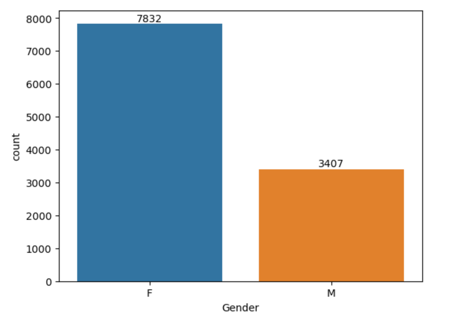
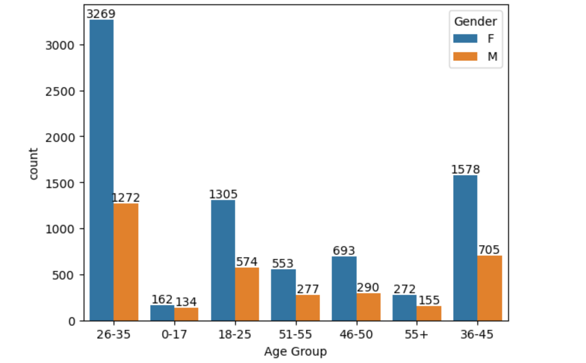
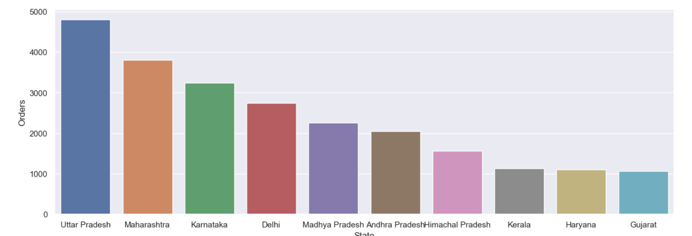
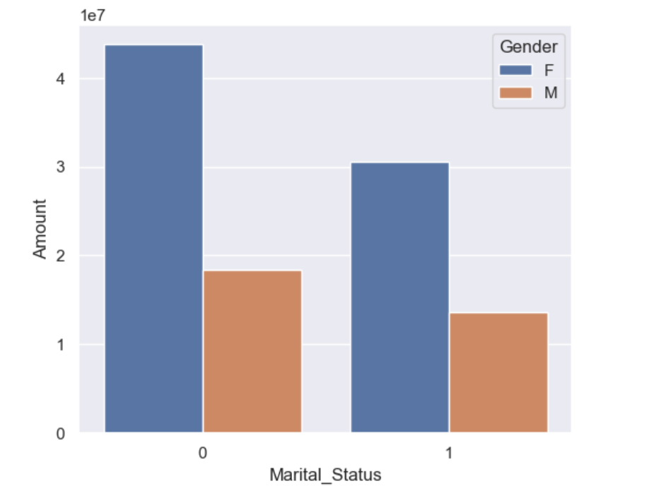
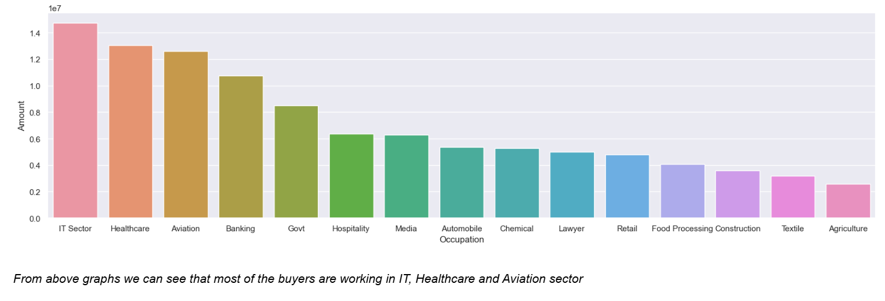
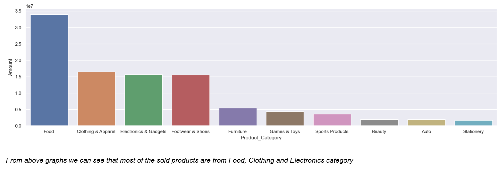
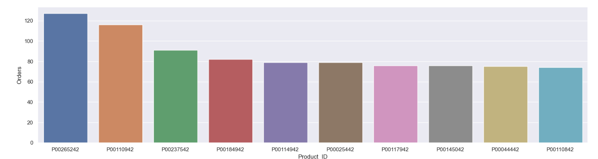

# 🪔 Diwali Sales Analysis

## 📌 Project Overview  
This project analyzes **Diwali sales data** using Python to uncover customer behavior, purchasing trends, and product performance.  
The analysis helps businesses understand their customer base, improve marketing strategies, and boost future sales.

---

## 📂 File Structure

- **Diwali-Sales-Analysis/**
  - `Diwali Sales Data.csv` → Dataset used for analysis  
  - `Diwali_Sales_Analysis.ipynb` → Jupyter Notebook with full analysis  
  - `README.md` → Project documentation  
  - **images/** → Visualizations from analysis  
    - `gender.png`  
    - `most_of_the_buyers_are_of_age_group_between_26_35_yrs_female.png`  
    - `total_number_of_orders_from_top_10_states.png`  
    - `most_buyers.png`  
    - `most_sold_products.png`  
    - `top_10_most_sold_products.png`

---

## 🛠️ Technologies Used
- **Python**
- **Pandas** – Data manipulation  
- **NumPy** – Numerical operations  
- **Matplotlib / Seaborn** – Data visualization  
- **Jupyter Notebook** – Interactive analysis  

---

## 📊 Key Analysis & Insights  

### 👩 Gender-based Sales  
- Majority of the buyers are **females**.  
- **Purchasing power of females is greater** compared to males.  

---

### 👥 Age Group Analysis  
- Most buyers are from the **26–35 years** age group.  
- Female customers in this age group dominate sales.  

---

### 🌍 State-wise Analysis  
- Top contributing states: **Uttar Pradesh, Maharashtra, Karnataka**.  

---

### 💍 Marital Status  
- Most buyers are **married women**, showing higher purchasing power.  

---

### 💼 Occupation Analysis  
- Majority of the buyers work in **IT, Healthcare, and Aviation sectors**.  

---

### 🛒 Product Category Analysis  
- Most sold products are from **Food, Clothing & Apparel, and Electronics categories**.  

---

### 🔝 Top Products  
- Top 10 most sold products identified by **Product ID**.  

---

## ✅ Conclusion  
- Business has a **strong female customer base**, especially in the **26–35 years age group**.  
- Majority of buyers are **married women** working in **IT, Healthcare, and Aviation**.  
- **Top contributing states** are Uttar Pradesh, Maharashtra, and Karnataka.  
- **Food, Clothing, and Electronics** dominate product categories.  

📈 These insights can help businesses **target marketing campaigns, improve product offerings, and boost sales in upcoming festive seasons.**

---
---

## 👨‍💻 Author

**Kulvant Dhaker**  
*Data Analyst*

- 📧 **Email**: dhakerkulvant@gmail.com
- 💼 **LinkedIn**: [linkedin.com/in/dhakerkulvant01](https://www.linkedin.com/in/dhakerkulvant01)
- 🔗 **GitHub**: [github.com/DhakerKulvant](https://github.com/DhakerKulvant)

*Transforming data into actionable business insights*

---
